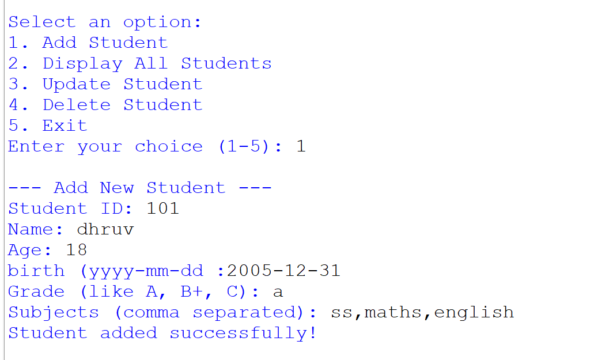
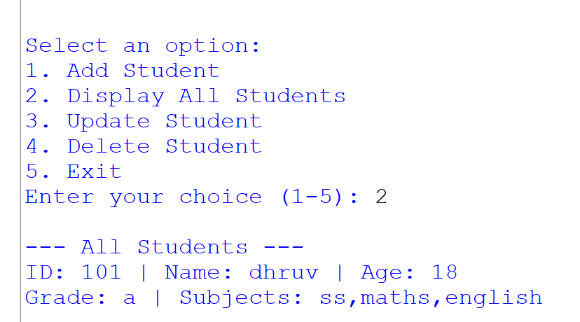
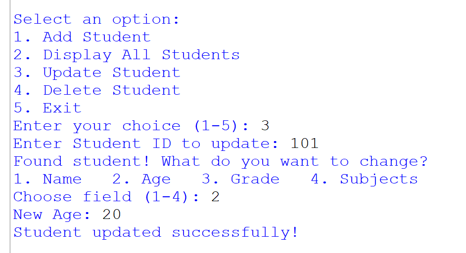
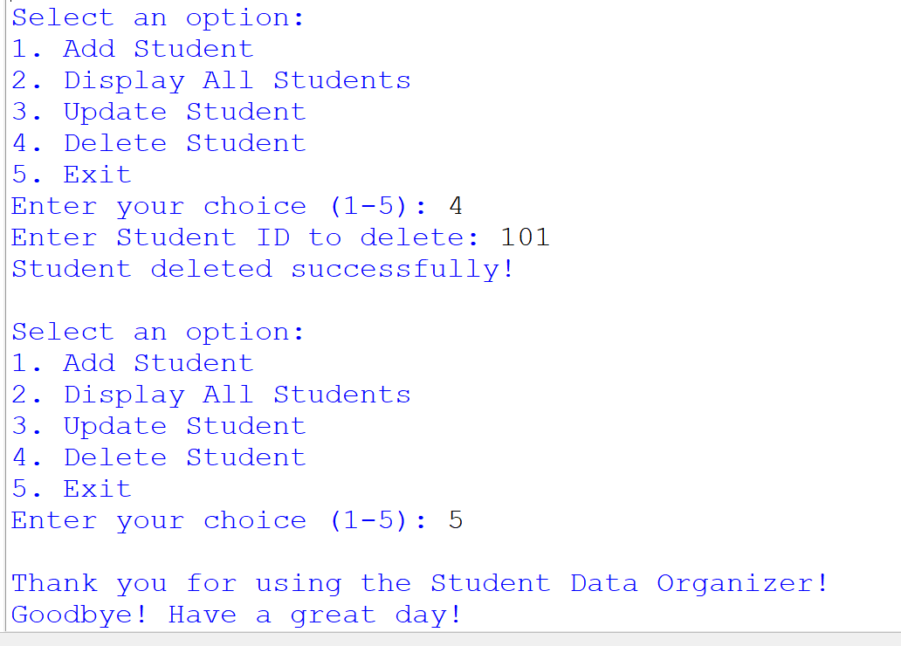

# 📚 Student Data Organizer (Python)

A simple **menu-driven Python console application** to manage student records. This project allows you to **add, view, update, and delete student information** using basic Python concepts like lists, dictionaries, loops, and conditionals.

---

## 🚀 Project Overview

The **Student Data Organizer** is designed for beginners to understand how real-world data can be managed using Python. All student data is stored in memory while the program is running.

Each student record includes:

* Student ID
* Name
* Age
* Date of Birth
* Grade
* Subjects

---

## 🛠️ Technologies Used

* **Language:** Python 3
* **Concepts Used:**

  * Lists
  * Dictionaries
  * Loops (`while`, `for`)
  * Conditional statements (`if-elif-else`)
  * User input/output

---

## 📂 Project Structure

```
project-folder/
│
├── projects.py   # Main Python program
├── README.md     # Project documentation
```

---

## ▶️ How to Run the Project

1. Make sure Python 3 is installed on your system.
2. Open a terminal or command prompt.
3. Navigate to the project folder.
4. Run the program using:

```bash
python projects.py
```

---

## 📋 Program Features & Working

### 🔹 1. Add Student

* Allows the user to enter a new student record.
* Inputs include ID, name, age, birth date, grade, and subjects.
* Data is stored in a list as a dictionary.

📸 **Screenshot – Add Student:**





### 🔹 2. Display All Students

* Displays all stored student records.
* Shows ID, name, age, grade, and subjects.
* If no students exist, it shows a friendly message.

📸 **Screenshot – Display All Students:**




### 🔹 3. Update Student

* User can update an existing student using their **Student ID**.
* Fields that can be updated:

  * Name
  * Age
  * Grade
  * Subjects
* Confirms successful update or shows an error if ID is not found.

📸 **Screenshot – Update Student :**




### 🔹 4. Delete Student

* Deletes a student record using Student ID.
* Confirms deletion or shows a message if ID does not exist.

📸 **Screenshot – Delete Student :**




